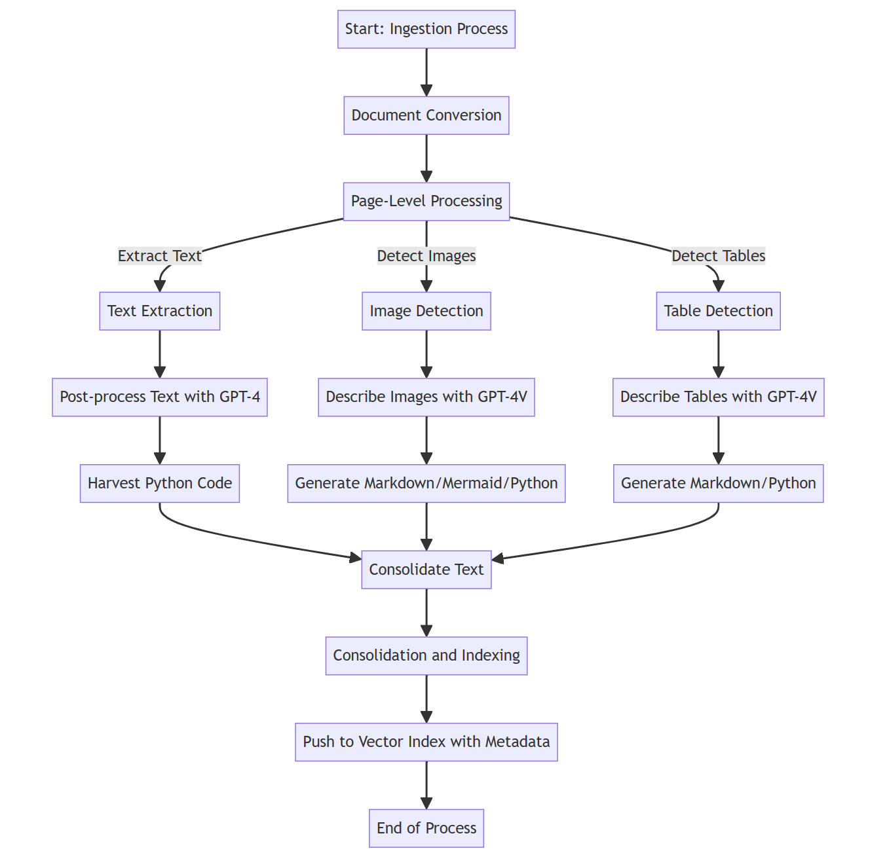

> **Note:**
> This repo and its README is a work in progress. The instructions to install and run here might not be comprehensive (yet), and code might break from time to time.

> **Note:**
> Please check our Powerpoint presentation [here](images/RAG-CE%20Pres.pptx). 

> **Note:**
> Start with the Demo Notebook [here](notebooks/demo_notebook.ipynb). 


<br/>

# Research CoPilot: Multimodal RAG with Code Execution
Multimodal Document Analysis with RAG and Code Execution: using Text, Images and Data Tables with GPT4-V, TaskWeaver, and Assistants API:


1. The work focuses on processing multi-modal analytical documents by extracting text, images, and data tables to maximize data representation and information extraction, utilizing formats like Python code, Markdown, and Mermaid script for compatibility with GPT-4 models.
1. Text is programmatically extracted from documents, processed to improve structure and tag extraction for better searchability, and numerical data is captured through generated Python code for later use.
1. Images and data tables are processed to generate multiple text-based representations (including detailed text descriptions, Mermaid, and Python code for images, and various formats for tables) to ensure information is searchable and usable for calculations, forecasts, and applying machine learning models using Code Interpreter capabilities.


<br/>

## Current Challenges
1. As of today with conventional techniques, to be able to search through a knowledge base with RAG, text from documents need to be extracted, chunked and stored in a vector database
1. This process now is purely concerned with text: 
    * If the documents have any images, graphs or tables, these elements are usually either ignored or extracted as messy unstructured text
    * Retrieving unstructured table data through RAG will lead to very low accuracy answers
1. LLMs are usually very bad with numbers. If the query requires any sort of calculations, LLMs usually hallucinate or make basic math mistakes


<br/>

## Why do we need this solution?

1. Ingest and interact with multi-modal analytics documents with lots of graphs, numbers and tables
1. Extract structured information from some elements in documents which wasn’t possible before:
    * Images
    * Graphs
    * Tables
1. Use the Code Interpreter to formulate answers where calculations are needed based on search results 


<br/>


## Examples of Industry Applications

1. Analyze Investment opportunity documents for Private Equity deals
1. Analyze tables from tax documents for audit purposes
1. Analyze financial statements and perform initial computations
1. Analyze and interact with multi-modal Manufacturing documents 
1. Process academic and research papers
1. Ingest and interact with textbooks, manuals and guides
1. Analyze traffic and city planning documents 

<br/>


## Important Findings

1. GPT-4-Turbo is a great help with its large 128k token window
1. GPT-4-Turbo with Vision is great at extracting tables from unstructured document formats
1. GPT-4 models can understand a wide variety of formats (Python, Markdown, Mermaid, GraphViz DOT, etc..) which was essential in maximizing  information extraction
1. A new approach to vector index searching based on tags was needed because the Generation Prompts were very lengthy compared to the usual user queries
1. Taskweaver’s and Assistants API’s Code Interpreters were introduced to conduct open-ended analytics questions

<br/>
<br/>


# Solution Stages

This solution implements a three-stage process: 
1. Ingestion stage for extracting data
1. Search stage for enabling search capabilities with code execution, and (3)
1. Generation stage for creating custom-tailored outputs such as business or industry overviews.


<br />

## Ingestion Process


<br />
<p align="center">

</p>
<br/>


<br/>

## Search Process


<br />
<p align="center">

</p>
<br/>


<br/>
<br/>

# Installation

The below will inform the user on how to set up and install this solution.


<br/>

## Azure Resource Requirements
The below resources need to be created before using this repo:

1. GPT-4-Turbo and GPT-4-Vision models in Azure OpenAI resource(s)
1. AI Search resource (Enable Semantic Search)
1. Web App resource
1. Azure Vision resource

<br/>

## Deployment of the infrastucture and application
The user has two options: 
1. The user can use the Chainlit web app locally on his computer
1. The user can deploy the solution to an Azure Web App. In the `deployment` folder, the user can the `deployment.sh` bash script to deploy the web app.


## Azure Arquitecture Review:

This repository contains the Bicep code to deploy an Azure App Services baseline architecture with zonal redundancy and the Azure Open Ai resource deployed in the four regions that are currently (**as of Jan 2024**) supported to run the GPT -4 Vision model.


## Architecture Components

### Networking

- **Virtual Network**: The fundamental networking backbone within Azure.
- **Application Gateway Subnet with Azure Web Application Firewall**: Protects the app against web vulnerabilities.
- **App Service Integration Subnet**: Dedicated to integrating Azure services.
- **Private Endpoint Subnet**: Hosts network interfaces for private connections to Azure services.

### Security and Identity

- **Managed Identity**: Automates the provision of Azure Active Directory identities for secure inter-service authentication.
- **Azure Active Directory**: Manages user identities and permissions.
- **Azure Key Vault**: Secures application secrets, keys, and certificates.

### Compute and Storage

- **App Service**: Host all the user interface to provide the application functionality
- **App Service Instance Zone 1, 2, 3**: Ensures high availability across different zones.
- **Azure Container Registries**: Stores Docker container images for the application
- **Azure Storage**: Provides scalable cloud storage services to host all iof the ingested documents and the prompt templates.


### Monitoring and Operations

- **Azure Monitor/Application Insights**: Offers advanced analytics and machine learning-driven insights.
- **Private DNS Zones**: Allows for internal name resolution within the Azure network.
- **Monitoring**: Tracks health, performance, and usage of the application and infrastructure.

## Benefits

1. **Security**: Enhanced with private connections, Bastion Host, jumpbox VM, DDoS protection, WAF, and secure secret management using keyvault.
2. **Scalability**: App Services can dynamically adapt to varying loads.
3. **Availability**: Distributed across availability zones to ensure continuous operation.
4. **Performance**: Optimized routing and low-latency operations due to proximity of services.
5. **Manageability**: Simplified management with integrated monitoring and identity services.
6. **Compliance**: Supports regulatory compliance by safeguarding data.
7. **Cost-Effectiveness**: Reduces overhead and operational costs through PaaS solutions.


The architecture is designed for organizations that require robust security, high scalability, and uninterrupted availability for their mission-critical applications.

## Prerequisites

1. Ensure you have an [Azure Account](https://azure.microsoft.com/free/)
1. The deployment must be started by a user who has sufficient permissions to assign [roles](https://learn.microsoft.com/azure/role-based-access-control/built-in-roles), such as a User Access Administrator or Owner.
1. Ensure you have the [Azure CLI installed](https://learn.microsoft.com/cli/azure/install-azure-cli)
1. The bicep code has been tested with bicep version: **v0.26.54**, make sure you have at least this version. Ensure you have the [az Bicep tools installed](https://learn.microsoft.com/azure/azure-resource-manager/bicep/install)
1. The script by default uses locally docker to build the  container image therefore **you need to install Docker** otherwise the depoloyment of the web app will fail
https://docs.docker.com/desktop/install/windows-install/


> **IMPORTANT!**
>
> This deployment requires that the user accepts the use of Cognitive Services. Unfortunately,as of today this needs to be done manually. 
>
> If you have never created a Cognitive Service before, please follow these steps:
>
> 1. Go to the [Azure Portal](https://portal.azure.com/)
> 2. Create any Cognitive Service
> 3. Accept the usage conditions during the creation process
>> 

## Networking 

The infrastucture deploys all the PaaS components behind a private endpoint. Therefore the following Vnet and Subnets are required: 


| Name                     | Default Value   |
|--------------------------|-----------------|
| Vnet Address             | '10.0.0.0/16'   |
| Application Gateway Subnet | '10.0.1.0/24' |
| App Services Subnet      | '10.0.0.0/24'   |
| Private Endpoints Subnet | '10.0.2.0/27'   |
| DevOps Agents or jump box VM Subnet     | '10.0.2.32/27'  |
| Azure Bastion Subnet     | '10.0.3.0/27'  |

## Adjusting the network configuration to your needs:
In the companion deploy.sh file you can see the following variables declared: 

- vnetAddressPrefix: '10.0.0.0/16'
- appGatewaySubnetPrefix: '10.0.1.0/24'
- appServicesSubnetPrefix: '10.0.0.0/24'
- privateEndpointsSubnetPrefix: '10.0.2.0/27'
- agentsSubnetPrefix: '10.0.2.32/27'  

**Do adjust** these ones with the required values. **Do not decrease the CDR** as these settings are following Microsoft best practices in terms of IPs allocations. 

## A note on the Azure Open AI deployments
This solution requires 4 Open AI deployments to accelerate the ingestion process. 
As of Jan 2024, the supported locations for GTP4-Vision model are: 

| Supported Regions (Jan 2024)                   |
|--------------------------|
| Australia East            |
| Japan East |
| Sweeden central      | 
| Switzerland | 

If the deployment script fails while deploying to these regions might be due to one of the following reasons (among others):

1. **Case 1:** You run out of quota for the GPT4 model.  
**Solution:** You will need to work on requesting more quota for the model.

2. **Case 2:** One of the regions does not support the GPT4-V model anymore.  
**Solution:** You will need to research what are the supported regions at the moment of running the script.


## A note on the AI search deployment
This solution uses Semantic Ranker to improve the search results, and as of Jan 2024, the supported locations are: 

| Supported Regions Jan 2024 |
|---------------------------|
| Canada Central            |
| Canada East               |
| Central US                |
| East US                   |
| East US 2                 |
| North Central US          |
| South Central US          |
| West Central US           |
| West US                   |
| West US 2                 |
| West US 3                 |

 https://azure.microsoft.com/en-gb/explore/global-infrastructure/products-by-region/?products=search

**The default region is East US**, to select a different version just pass the paramater aiSearchRegion to the deplate: 


```bash
aiSearchRegion='eastus'
PREFIX=dev
MMSYS_NO_PATHCONV=1 az deployment group create --template-file ./infra-as-code/bicep/main.bicep \
    --resource-group $RESOURCE_GROUP \
        --parameters appGatewayListenerCertificate=$appGatewayListenerCertificate \
                 namePrefix=$PREFIX \
                 aiSearchRegion=$aiSearchRegion \
                 vnetAddressPrefix=$vnetAddressPrefix \
                 appGatewaySubnetPrefix=$appGatewaySubnetPrefix \
                 appServicesSubnetPrefix=$appServicesSubnetPrefix \
                 privateEndpointsSubnetPrefix=$privateEndpointsSubnetPrefix\
                 agentsSubnetPrefix=$agentsSubnetPrefix \
```

## A note on re-deplying the infrastucture
Keep in mind that Open AI and Computer vision are services that have quota. Therefore, if you delete the resource group and then you re-deploy the whole solution again, Open AI and Computer Vision are soft-deleted by default. You will need to go the Azure Portal, go to Azure Open AI services or Cumputer Vision and select the option Manage deleted resources and purge the resources  that you are not using anymore.


## Deploy the infrastructure

The following steps are required to deploy the infrastructure from the command line.

1. In your command-line tool where you have the Azure CLI and Bicep installed, navigate to the root directory of this repository (AppServicesRI)

1. Login and set subscription if it is needed

```bash
  az login
  az account set --subscription xxxxx
```

1. Obtain App gateway certificate
   Azure Application Gateway support for secure TLS using Azure Key Vault and managed identities for Azure resources. This configuration enables end-to-end encryption of the network traffic using standard TLS protocols. For production systems you use a publicly signed certificate backed by a public root certificate authority (CA). Here, we are going to use a self signed certificate for **demonstrational purposes**.

   The default isntallation creates a dummy certificate without password with contoso.com as the CN. 
   >
   **This is not secure and your organization should provide the proper certificate and then perform the Application Gateway configuration manually to suit your organization needs**
   >>
     
     Create a bash script:


   - Set a variable for the domain that will be used in the rest of this deployment.

     ```bash
     export DOMAIN_NAME_APPSERV_BASELINE="contoso.com"
     ```

   - Generate a client-facing, self-signed TLS certificate.

     :warning: Do not use the certificate created by this script for actual deployments. The use of self-signed certificates are provided for ease of illustration purposes only. For your App Service solution, use your organization's requirements for procurement and lifetime management of TLS certificates, _even for development purposes_.

     Create the certificate that will be presented to web clients by Azure Application Gateway for your domain.
     
     **NON-WINDOWS USERS**

     ```bash
     openssl req -x509 -nodes -days 365 -newkey rsa:2048 -out appgw.crt -keyout appgw.key -subj "/CN=${DOMAIN_NAME_APPSERV_BASELINE}/O=Contoso" -addext "subjectAltName = DNS:${DOMAIN_NAME_APPSERV_BASELINE}" -addext "keyUsage = digitalSignature" -addext "extendedKeyUsage = serverAuth"
     openssl pkcs12 -export -out appgw.pfx -in appgw.crt -inkey appgw.key -passout pass:
     ```
     **WINDOWS USERS**
     1. **Replace the parameter**: -subj like this --> -subj "//O=Org\CN=Name"
     2.  **MMSYS_NO_PATHCONV=1** if you get errors on the path is because your bash is loading the existing path to the execution path. you have to call the openssl command using: MMSYS_NO_PATHCONV=1 like this --> MMSYS_NO_PATHCONV=1 openssl req -x509 -rest of the comand...
     
     **REPLACE** windows_path with the location of your openssl installation.
   
       ```bash     
     windows_path="C:\Program Files\FireDaemon OpenSSL 3\bin"
     export OPENSSL_CONF=$windows_path
     MMSYS_NO_PATHCONV=1 openssl req -x509 -nodes -days 365 -newkey rsa:2048 -out appgw.crt -keyout appgw.key -subj "\CN=${DOMAIN_NAME_APPSERV_BASELINE}//O=Contoso" -addext "subjectAltName = DNS:${DOMAIN_NAME_APPSERV_BASELINE}" -addext "keyUsage = digitalSignature" -addext "extendedKeyUsage = serverAuth"
     MMSYS_NO_PATHCONV=1 openssl pkcs12 -export -out appgw.pfx -in appgw.crt -inkey appgw.key -passout pass:
     ```


     No matter if you used a certificate from your organization or you generated one from above, you'll need the certificate (as `.pfx`) to be Base64 encoded for proper storage in Key Vault later.


     ```bash
     export APP_GATEWAY_LISTENER_CERTIFICATE_APPSERV_BASELINE=$(cat appgw.pfx | base64 | tr -d '\n')
     echo APP_GATEWAY_LISTENER_CERTIFICATE_APPSERV_BASELINE: $APP_GATEWAY_LISTENER_CERTIFICATE_APPSERV_BASELINE
     ```

<br/>

## Taskweaver Installation
TaskWeaver requires **Python >= 3.10**. It can be installed by running the following command from the project root folder. Please follow the below commands **very carefully** and start by creating a **new** conda environment:

```bash
# create the conda environment
conda create -n mmdoc python=3.10

# activate the conda environment
conda activate mmdoc

# install the project requirements
pip install -r requirements.txt

# clone the repository
git clone https://github.com/microsoft/TaskWeaver.git

# cd into Taskweaver
cd TaskWeaver

# install the Taskweaver requirements
pip install -r requirements.txt

# copy the Taskweaver project directory into the root folder and name it 'test_project'
cp -r project ../test_project/

```

<br/>

> **Note:**
> Inside the `test_project` directory, there's a file called `taskweaver_config.json` which needs to be populated. Please refer to the `taskweaver_config.sample.json` file in the root folder of this repo, fill in the Azure OpenAI model values for GPT-4-Turbo, rename it to `taskweaver_config.json`, and then copy it inside `test_project` (or overwrite existing).

<br/>

> **Note:**
> Similiarly, there are a number of test notebooks in this solution that use Autogen. If the user wants to experiment with Autogen, then in this case, the file `OAI_CONFIG_LIST` in the `code` folder needs to be configured. Please refer to `OAI_CONFIG_LIST.sample`, populate it with the right values, and then rename it to `OAI_CONFIG_LIST`.

<br/>

## Code Interpreters

Code Interpreters Available in this Solution:
1. Taskweaver: is fully supported
1. Assistants API: OpenAI AssistantsAPI is supported for now. The Azure version will soon follow when it's released.


<br/>
<br/>


# Web Apps

There are two web apps that are implemented as part of this solution. The Streamlit web app and the Chainlit web app.

1. The Streamlit web app includes the following: 
    * The web app can ingest documents, which will create an ingestion job either using Azure Machine Learning (recommended) or using a Python sub-process on the web app itself (for local testing only). 
    * The second part of the Streamlit app is Generation. The "Prompt Management" view will enable the user to build complex prompts with sub-sections, save them to Cosmos, and use the solution to generate output based on these prompts
1. The Chainlit web app is used to chat with the ingested documents, and has advanced functionality, such as an audit trail for the search, and references section for the answer with multimodal support (images and tables can be viewed).

<br/>

## Running the Chainlit Web App

The Chainlit web app is the main web app to chat with your data. To run the web app locally, please execute in your conda environment the following:
```bash
# cd into the app folder
cd ui

# run the chainlit app
chainlit run chat.py
```
<br/>


## Running the Streamlit Web App

The Streamlit web app is the main web app to ingest your documents and to build prompts for Generation. To run the web app locally, please execute in your conda environment the following:
```bash
# cd into the app folder
cd ui

# run the chainlit app
streamlit run main.py
```
<br/>


### Guide to configure the Chainlit and Streamlit Web Apps

1. Configure properly your `.env` file. Refer to the `.env.sample` file included in this solution.
1. In the Chainlit web app, use `cmd index` to set the index name.


<br/>

### Commands Supported in the Chainlit Web App

The below outlines the primary commands and options available in the testing tool for the Research CoPilot solution.

| **Command**           | **Usage**                                                                                       |
|:--------------------- |:------------------------------------------------------------------------------------------------|
| **cmd index**         | Type `cmd index` to change the name of the AI Search index.                                     |
| **cmd password**      | Type `cmd password` to change the PDF password (if PDFs are password-protected).                |
| **cmd tag_limit**     | Type `cmd tag_limit` to change the upper limits of the generated tags per query for the search.   |
| **cmd topN**          | Type `cmd topN` to change how many top N results to fetch while executing the search.   |
| **cmd pdf_mode**      | Type `cmd pdf_mode` to change the PDF extraction mode. Allowed values are 'gpt-4-vision' or 'document-intelligence'.   |
| **cmd docx_mode**     | Type `cmd docx_mode` to change the docx extraction mode. Allowed values are 'document-intelligence' or 'py-docx'.   |
| **cmd threads**       | Type `cmd threads` to change the number of threads. Allows for multi-threading during ingestion. Make sure that AZURE_OPENAI_RESOURCE_x and AZURE_OPENAI_KEY_x are properly configured in your .env file.     |
| **cmd delete_dir**    | Type `cmd delete_dir` to enable or disable deleting existing output directory if ingestion is restarted.                  |
| **cmd ci**            | Type `cmd delete_dir` to change the used Code Interpreter. Allowed values are "NoComputationTextOnly", "Taskweaver", "AssistantsAPI", or "LocalPythonExec".                  |
| **cmd upload**        | Type `cmd upload` to upload document files for ingestion.                                        |
| **cmd ingest**        | Type `cmd ingest` to start the ingestion process of the uploaded files.                         |
| **cmd prompts**       | Type `cmd prompts` to display all available generation prompts.                                |
| **cmd gen**           | Type `cmd gen` to generate from pre-existing prompts.                                             |
| **Query**             | Type your query in plain English and wait for the response.                                     |


<br/>
<br/>


