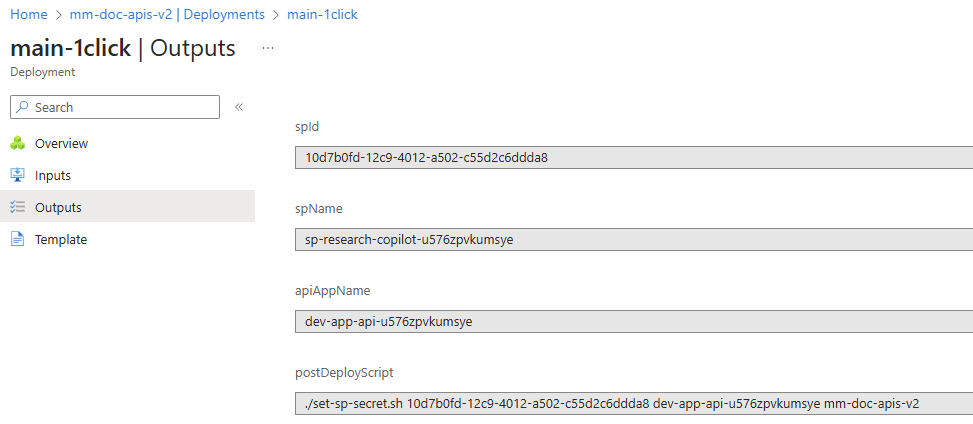
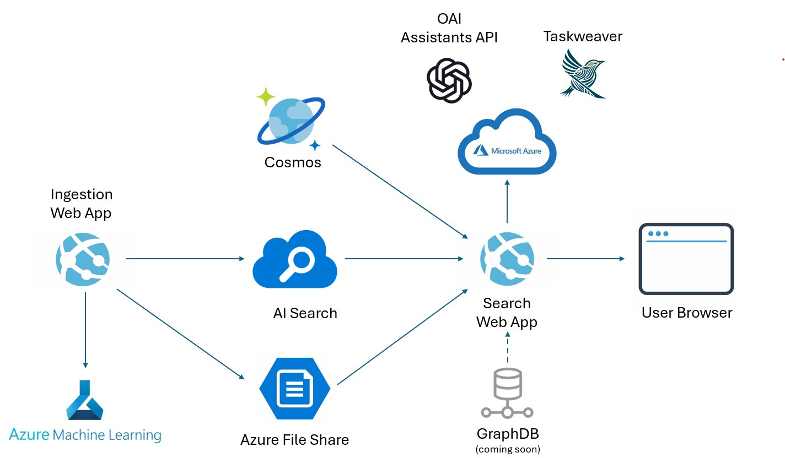

> **Note:**
> Start with the Tutorial Notebooks in the Tutorials folder [here](tutorials/). 


<br/>

# Research CoPilot: Multimodal RAG with Code Execution
Multimodal Document Analysis with RAG and Code Execution: using Text, Images and Data Tables with GPT4-V, TaskWeaver, and Assistants API:

1. **"Chat-With-Your-Multimodal-Data"**: Implemented a GenAI solution to automatically ingest and analyze multimodal documents, including texts, tables, and images, and produce searchable semantic contents.
1. **Content Generation**: The solution can be used to output most of the contents needed for standardized formats, such as memos or PowerPoint presentations that highlights essential facts about the ingested data
1. **Analytical Queries with OpenAI Assistants API and Taskweaver**: Develop an advanced feature allowing analysts to interact with the multimodal data using a chat interface integrated with a Code Interpreter. This tool will support complex analytical queries, including calculations and on-the-fly graph and file generation.


## Deployment steps (Azure Portal)

1. Click the "Deploy to Azure" button

    [](https://portal.azure.com/?feature.customportal=false#create/Microsoft.Template/uri/https%3A%2F%2Fraw.githubusercontent.com%2FAzure-Samples%2Fmultimodal-rag-code-execution%2Fmain%2Fdeployment%2Finfra-as-code-public%2Fbicep%2Fmain-1click.json)

1. Fill in parameters

    There no special parameters for this deployment. Optional parameters are available to customize the deployment (see below). Typically, only `openAIName` and `openAIRGName` are used to reuse an existing Azure OpenAI resource.

    Average deployment time is 10 minutes when no existing container registry is set.

1. Finalize deployment

    After the deployment is complete, you will need to run a post-deployment script to create the secret and assign it to the API WebApp.

    1. Open the **Azure Cloud Shell (Bash)**
    1. Upload the [`set-sp-secret.sh`](deployment/infra-as-code-public/bicep/set-sp-secret.sh) script to the Cloud Shell
    1. Run `chmod +x ./set-sp-secret.sh`
    1. Run `./set-sp-secret.sh <app-name> <api-webapp-name> <ml-workspace-name> <resource-group-name>`.
    
    Values can be found in the deployment outputs: go to the resource group, select the deployment `main-1click`, and click on the `Outputs` tab.

<br />

**Note**: Upload script to cloud shell.
<br />
<p align="center">

</p>
<br/>


**Note**: Copy and paste the script call with the correct values.
<br />
<p align="center">

</p>
<br/>


### Customization
For additional deployment customization, follow the detailed instructions available in the [Deployment README](deployment/README.md) guide.

<br/>
<br/>

## Research Copilot YouTube Video
<p align="center">

[](https://youtu.be/Si4m-Zl9xvQ)

</p>
<br/>
<br/>

## Description
1. The work focuses on processing multi-modal analytical documents by extracting text, images, and data tables to maximize data representation and information extraction, utilizing formats like Python code, Markdown, and Mermaid script for compatibility with GPT-4 models.
1. Text is programmatically extracted from documents, processed to improve structure and tag extraction for better searchability, and numerical data is captured through generated Python code for later use.
1. Images and data tables are processed to generate multiple text-based representations (including detailed text descriptions, Mermaid, and Python code for images, and various formats for tables) to ensure information is searchable and usable for calculations, forecasts, and applying machine learning models using Code Interpreter capabilities.

<br/>
<br />

## Current Challenges
1. As of today with conventional techniques, to be able to search through a knowledge base with RAG, text from documents need to be extracted, chunked and stored in a vector database
1. This process now is purely concerned with text: 
    * If the documents have any images, graphs or tables, these elements are usually either ignored or extracted as messy unstructured text
    * Retrieving unstructured table data through RAG will lead to very low accuracy answers
1. LLMs are usually very bad with numbers. If the query requires any sort of calculations, LLMs usually hallucinate or make basic math mistakes


<br/>

## Why do we need this solution?

1. Ingest and interact with multi-modal analytics documents with lots of graphs, numbers and tables
1. Extract structured information from some elements in documents which wasn’t possible before:
    * Images
    * Graphs
    * Tables
1. Use the Code Interpreter to formulate answers where calculations are needed based on search results 


<br/>


## Examples of Industry Applications

1. Analyze Investment opportunity documents for Private Equity deals
1. Analyze tables from tax documents for audit purposes
1. Analyze financial statements and perform initial computations
1. Analyze and interact with multi-modal Manufacturing documents 
1. Process academic and research papers
1. Ingest and interact with textbooks, manuals and guides
1. Analyze traffic and city planning documents 

<br/>
<br/>

# Solution Features

The following are technical features implemented as part of this solution:

1. Supported file formats are PDFs, MS Word documents, MS Excel sheets, and csv files. 
1. Ingestion of multimodal documents including images and tables
1. Ingestion jobs run on Azure Machine Learning for reliable long-duration execution and monitoring
1. Full deployment script that will create the solution components on Azure and build the docker images for the web apps
1. Hybrid search with AI Search using vector and keyword search, and semantic re-ranker
1. Extraction of chunk-level tags and whole-document-level chunks to optimize keyword search
1. Whole document summaries used as part of the final search prompt to give extra context 
1. Code Execution with the OpenAI Assistants API Code Interpreter
1. Tag-based Search for optimizing really long user query, e.g. Generation Prompts
1. Modular and easy-to-use interface with Processors for customizable processing pipelines
1. Smart chunking of Markdown tables with repeatable header and table summary in every chunk
1. Support for the two new embedding models `text-embedding-3-small` and `text-embedding-3-large`, as well as for `text-embedding-ada-002`


### In-the-Works Upcoming Features

1. Dynamic semantic chunking with approximate fixed size chunks (soon)
1. Graph DB support for enhanced data retrieval. The Graph DB will complement, and not replace, the AI Search resource.


<br/>
<br/>

# The Concept of Processing Pipelines and Processors

For the sake of providing an extendable modular architecture, we have implemented in this accelerator the concept of a processing pipeline, where each document undergoes a pre-specified number of processing steps, each step adding some degree of change to the documents. Processors are format-specific (e.g. PDF, MS Word, Excel, etc..), and are created to ingest multimodal documents in the most efficient way for that format. Therefore the list of processing steps for a PDF is different than the list of steps for an Excel sheet. This is implemented in the `processor.py` Python file. The list of processing steps can be customized by changing the file `processing_plan.json`. As an example, processing Excel files will follow the below steps, each step building on the results of the previous one:
1. `extract_xlsx_using_openpyxl`: read the Excel sheet with OpenPyxl and store it in a dataframe.
1. `create_table_doc_chunks_markdown`: go through the dataframe after converting it to Markdown, and chunk into text in a smart way: chunks that are almost equal in size but without breaking any sentences in the middle.
1. `create_image_doc_chunk`s: extract images from the Excel if any
1. `generate_tags_for_all_chunks`: for each chunk of text, generate tags. This is very important for hybrid search in AI Search.
1. `generate_document_wide_tags`: genereate tags for the whole documents. This is very important for hybrid search in AI Search.
1. `generate_document_wide_summary`: provide a document summary that will be inserted into the Context for RAG, as well as the top chunks.
1. `generate_analysis_for_text`: provide an analysis for each chunk of text in relation to the whole document, e.g. what does chunk add as information vs the whole text.

At the start of the processing pipeline, a Python dictionary variable called `ingestion_pipeline_dict` with all the input parameters is created in the constructor of the Processor and then passed to the first step. The step will do its own processing, will change variables inside the `ingestion_pipeline_dict` and will add new ones. The `ingestion_pipeline_dict` is then returned by this first step, and will then become the input for the second step. This way, the `ingestion_pipeline_dict` is passed from each step to the next downstream the pipeline. It is the common context which all steps work on. The `ingestion_pipeline_dict` is saved in a text file at the end of each step, so as to provide a way for debugging and troubleshooting under the processing folder name in the `stages` directory.

This is a visual representation of a pipeline:

<br />
<p align="center">

</p>
<br/>

<br/>


At the end of this document, there is a [list](#processing-steps) of all the steps and a short explanation for each one of them. The below JSON block describes the processing pipelines per document format per processing option: 
<br/>

```json
{
    ".pdf": {
        "gpt-4-vision": [
            "create_pdf_chunks", "pdf_extract_high_res_chunk_images", "pdf_extract_text", "pdf_extract_images", "delete_pdf_chunks", "post_process_images", "extract_tables_from_images", "post_process_tables", "generate_tags_for_all_chunks", "generate_document_wide_tags", "generate_document_wide_summary", "generate_analysis_for_text"
        ],
        "document-intelligence": [
            "create_pdf_chunks", "pdf_extract_high_res_chunk_images", "pdf_extract_text", "pdf_extract_images", "delete_pdf_chunks", "extract_doc_using_doc_int", "create_doc_chunks_with_doc_int_markdown", "post_process_images", "generate_tags_for_all_chunks", "generate_document_wide_tags", "generate_document_wide_summary", "generate_analysis_for_text"
        ],
        "hybrid": [
            "create_pdf_chunks", "pdf_extract_high_res_chunk_images", "delete_pdf_chunks", "extract_doc_using_doc_int", "create_doc_chunks_with_doc_int_markdown", "post_process_images", "post_process_tables", "generate_tags_for_all_chunks", "generate_document_wide_tags", "generate_document_wide_summary", "generate_analysis_for_text"
        ]
    },
    ".docx": {
        "py-docx": [
            "extract_docx_using_py_docx", "create_doc_chunks_with_doc_int_markdown", "post_process_images", "generate_tags_for_all_chunks", "generate_document_wide_tags", "generate_document_wide_summary", "generate_analysis_for_text"
        ],
        "document-intelligence": [
            "extract_doc_using_doc_int", "create_doc_chunks_with_doc_int_markdown", "post_process_images", "generate_tags_for_all_chunks", "generate_document_wide_tags", "generate_document_wide_summary", "generate_analysis_for_text"
        ]
    },
    ".xlsx": {
        "openpyxl": [
            "extract_xlsx_using_openpyxl", "create_table_doc_chunks_markdown", "create_image_doc_chunks", "generate_tags_for_all_chunks", "generate_document_wide_tags", "generate_document_wide_summary", "generate_analysis_for_text"
        ]
    }
}
```

<br/>


## Solution Architecture

The below is the logical architecture of this solution. The GraphDB is not yet added to the solution, but the integration is currently in development: 

<br />
<p align="center">

</p>
<br/>

<br/>


## Important Findings

1. GPT-4-Turbo is a great help with its large 128k token window
1. GPT-4-Turbo with Vision is great at extracting tables from unstructured document formats
1. GPT-4 models can understand a wide variety of formats (Python, Markdown, Mermaid, GraphViz DOT, etc..) which was essential in maximizing  information extraction
1. A new approach to vector index searching based on tags was needed because the Generation Prompts were very lengthy compared to the usual user queries
1. Taskweaver’s and Assistants API’s Code Interpreters were introduced to conduct open-ended analytics questions

<br/>
<br/>


# Enterprise Deployment

Please check our [Enterprise Deployment](ENTERPRISE_DEPLOYMENT.md) guide for how to deploy this in a secure manner to a client's tenant. For local development or testing the solution, please use the tutorial notebooks or the Chainlit app described below.

<br/>
<br/>


# Tutorial Notebooks

Please start with the Tutorial notebooks [here](tutorials/). These notebooks illustrate a series of concepts that have been used in this repo. 


<br/>
<br/>


# How to Use this Solution

There are two web apps that are implemented as part of this solution. The Streamlit web app and the Chainlit web app.

1. The Streamlit web app includes the following: 
    * The web app can ingest documents, which will create an ingestion job either using Azure Machine Learning (recommended) or using a Python sub-process on the web app itself (for local testing only). 
    * The second part of the Streamlit app is Generation. The "Prompt Management" view will enable the user to build complex prompts with sub-sections, save them to Cosmos, and use the solution to generate output based on these prompts
1. The Chainlit web app is used to chat with the ingested documents, and has advanced functionality, such as an audit trail for the search, and references section for the answer with multimodal support (images and tables can be viewed).

<br/>


## Prepare the local Conda Environment

The Conda environment can be installed by running the following commands from the **project root folder**. Please follow the below commands to create a **new** conda environment. The Python version can be >= 3.10 (but was thoroughly tested on 3.10):

```bash
# create the conda environment
conda create -n mmdoc python=3.10

# activate the conda environment
conda activate mmdoc

# install the project requirements
pip install -r requirements.txt
```

## Prepare the .env File 

Configure properly your `.env` file. Refer to the `.env.sample` file included in this solution. All non-optional values must be filled in, in order for this solution to function properly.

The .env file is used for:

1. Local Development if needed
1. The deployment script will read values from the `.env` file and will population the Configuration Variables for both web apps. 
1. To run the solution locally, add to the .env the following line: 
    `API_BASE_URL=http://localhost:9000`

<br/>

## Running the API Web App

The API web app **must** run first before the other two web apps. It provides API infrastructure for the other two web apps. To run the web app locally, please execute in your conda environment the following:

```bash
# cd into the code folder
cd code

# run the chainlit app
python -m uvicorn api:app --reload --port 9000

# go back to the project root folder
cd ..
```
<br/>


## Running the Chainlit Web App

The Chainlit web app is the main web app to chat with your data. To run the web app locally, please execute in your conda environment the following:

```bash
# Makre sure you're in the project root folder, then cd into the ui folder
cd ui

# run the chainlit app
chainlit run chat.py
```
<br/>


## Running the Streamlit Web App

The Streamlit web app is the main web app to ingest your documents and to build prompts for Generation. To run the web app locally, please execute in your conda environment the following:

```bash
# cd into the ui folder
cd ui

# run the chainlit app
streamlit run main.py
```
<br/>


### Guide to configure the Chainlit and Streamlit Web Apps

1. Configure properly your `.env` file. Refer to the `.env.sample` file included in this solution.
1. In the Chainlit web app, use `cmd index` to set the index name.


<br/>
<br/>


### Local Development for Azure Cloud

For rapid development iterations and for testing on the cloud, the `push.ps1` script can be used to build only the docker images and push them to the Azure Container Registry, without creating or changing any other component in the resource group or in the architecture. The docker images will have then to be **manually** assigned to the web app, by going to the web app page in the Azure Portal, and then navigate to `Deployment > Deployment Center` on the left-hand side, and then go to `Settings` on the right-hand side, then to the `Tag` dropdown and choose the correct docker image. 

Please edit the `push.ps1` script, and fill in the right values for the Azure Container Registry endpoint, username and password, for the Resource Group name, and Subscription ID. Then, to run the script, follow the below instrcutions in a `Powershell`. It is important that Docker Desktop version is installed and running at that point locally. The command has to be run from the root directory of the project: 

```bash
# cd into the root folder of the project
cd <project root>

# run the docker images update script
deployment/push.ps1
```
 
<br />
<p align="center">

</p>
<br/>


<br/>

## Code Interpreters

Code Interpreters Available in this Solution:
1. Assistants API: OpenAI AssistantsAPI is the default out-of-the-box code interpreter for this solution running on Azure.
1. Taskweaver: is optional to install and use, and is fully supported


<br/>

<br/>

## Taskweaver Installation (optional)


TaskWeaver requires **Python >= 3.10**. It can be installed by running the following command from the project root folder. Please follow the below commands **very carefully** and start by creating a **new** conda environment:

```bash
# create the conda environment
conda create -n mmdoc python=3.10

# activate the conda environment
conda activate mmdoc

# install the project requirements
pip install -r requirements.txt

# clone the repository
git clone https://github.com/microsoft/TaskWeaver.git

# cd into Taskweaver
cd TaskWeaver

# install the Taskweaver requirements
pip install -r requirements.txt

# copy the Taskweaver project directory into the root folder and name it 'test_project'
cp -r project ../test_project/

```

<br/>


> **Note:**
> Inside the `test_project` directory, there's a file called `taskweaver_config.json` which needs to be populated. Please refer to the `taskweaver_config.sample.json` file in the root folder of this repo, fill in the Azure OpenAI model values for GPT-4-Turbo, rename it to `taskweaver_config.json`, and then copy it inside `test_project` (or overwrite existing).

<br/>

> **Note:**
> Similiarly, there are a number of test notebooks in this solution that use Autogen. If the user wants to experiment with Autogen, then in this case, the file `OAI_CONFIG_LIST` in the `code` folder needs to be configured. Please refer to `OAI_CONFIG_LIST.sample`, populate it with the right values, and then rename it to `OAI_CONFIG_LIST`.

<br/>
<br/>


# Processing Steps

The `create_doc_chunks_with_doc_int_markdown` function is integral to the processing of documents, particularly when utilizing the Document Intelligence service. It's designed to handle the markdown conversion of document chunks, ensuring that the extracted data is formatted correctly for further analysis. This function is applicable to various document formats and is capable of processing text, images, and tables, making it versatile in the multimodal information extraction process. Its role is crucial in structuring the raw extracted data into a more accessible and analyzable form.

The `create_image_doc_chunks` function is integral to the processing of image data within multimodal documents. It specifically targets the extraction and organization of image-related content, segmenting each image as a discrete chunk for further analysis. This function is applicable across various document formats that include image data, playing a crucial role in the multimodal extraction pipeline by ensuring that visual information is accurately captured and prepared for subsequent processing steps such as tagging and analysis. It deals exclusively with the image modality, isolating it from text and tables to streamline the handling of visual content.

The `create_pdf_chunks` function is a crucial step in the document ingestion process, particularly for PDF files. It segments the input PDF document into individual chunks, which are then processed separately in subsequent stages of the pipeline. This function is applicable to all modalities within a PDF document, including text, images, and tables, ensuring a comprehensive breakdown of the document's content for detailed analysis and extraction. Its role is foundational, as it sets the stage for the specialized processing of each modality by other functions in the pipeline.

The function `create_table_doc_chunks_markdown` is responsible for processing tables within documents, specifically converting them into Markdown format. It is applicable to `.xlsx` files as part of the `openpyxl` pipeline. This function not only handles the conversion but also manages the chunking of tables when they are too large, ensuring that the Markdown representation is accurate and manageable. It processes the table modality exclusively and is crucial for preserving the structure and data of tables during the document ingestion process.

The `delete_pdf_chunks` function is a crucial step in the document processing pipeline, particularly for PDF files. It is responsible for removing the temporary storage of PDF chunks from memory, ensuring that the system resources are efficiently managed and not overburdened with unnecessary data. This function is applied after the initial extraction of high-resolution images and text from the PDF document, and before any post-processing of images or tables. It is applicable to all modalities—text, images, and tables—since it deals with the cleanup of data extracted from PDF chunks.

The `extract_doc_using_doc_int` function is a key component in the document processing pipeline, specifically tailored for handling `.docx` and `.pdf` files. It leverages the capabilities of Azure's Document Intelligence Service to analyze and extract structured data, including text and tables, from documents. This function is crucial for converting document content into a format that can be further processed for insights and is versatile in dealing with both textual and tabular data modalities.

The `extract_docx_using_py_docx` function is designed to handle the extraction of content from `.docx` files, specifically focusing on text, images, and tables. It utilizes the `python-docx` library to access and extract these elements, ensuring that the data is accurately retrieved and stored in a structured format suitable for further processing. This function is crucial for the initial stage of the ingestion pipeline, setting the foundation for subsequent analysis and processing steps. It is applicable to `.docx` files and is responsible for extracting all three modalities: text, images, and tables, from the document.

The `extract_tables_from_images` function is designed to identify and extract tables from image files within a document. It applies to image modalities, specifically targeting visual data representations such as tables embedded within image files. This function is crucial for converting visual table data into a structured format that can be further processed or analyzed, making it an essential step in multimodal document processing pipelines that deal with both textual and visual information. It is particularly relevant for documents where tabular information is presented in non-textual formats.

The `extract_xlsx_using_openpyxl` function is designed to handle the extraction of data from `.xlsx` files, specifically focusing on the retrieval of tables and their conversion into various formats for further processing. It leverages the `openpyxl` library to access and manipulate Excel files, ensuring that the extracted data is accurately represented in Python-friendly structures such as DataFrames. This function is crucial for parsing spreadsheet data, which is often rich in structured information, making it a key step in the data extraction phase for `.xlsx` files within the ingestion pipeline. It processes the table modality, transforming Excel sheets into Markdown, plain text, and Python scripts, which can then be integrated into the multimodal information extraction framework.

The `generate_analysis_for_text` function is designed to analyze the relationship between a specific text chunk and the overall content of a document. It highlights entity relationships introduced or extended in the text chunk, providing a concise analysis that adds context to the document's topics. This function is applicable to all modalities—text, images, and tables—ensuring a comprehensive understanding of the document's content. It plays a crucial role in enhancing the document's metadata by providing insights into the significance of each section within the larger document structure.

The `generate_document_wide_summary` function is responsible for creating a concise summary of the entire document's content. It extracts key information and presents it in a few paragraphs, ensuring that the essence of the document is captured without unnecessary details. This function is applicable to all document formats, including text, images, and tables, making it a versatile component in the multimodal information extraction pipeline. It plays a crucial role in providing a quick overview of the document, which can be beneficial for both indexing and search purposes.

The `generate_document_wide_tags` function is a crucial component in the document ingestion pipeline, applicable across various document formats including PDF, DOCX, and XLSX. It is responsible for extracting key tags from the entire document, which are essential for enhancing search and retrieval capabilities. This function processes text modality, ensuring that significant entities and topics within the document are captured as tags, aiding in the creation of a searchable index for the ingested content.

The `generate_tags_for_all_chunks` function is integral to the multimodal information extraction process, applicable across various document formats including PDF, DOCX, and XLSX. It operates on all three modalities—text, images, and tables—extracting and optimizing tags for enhanced search and retrieval within a vector store. This function ensures that each chunk of the document, regardless of its content type, is accurately represented by a set of descriptive tags, facilitating efficient indexing and subsequent search operations.

The `pdf_extract_high_res_chunk_images` function is responsible for extracting high-resolution images from each chunk of a PDF document. It plays a crucial role in the initial stages of the document processing pipeline, particularly for PDF formats, ensuring that visual data is captured in detail for subsequent analysis. This function focuses on the image modality, converting document chunks into PNG images at a DPI of 300, which are then used for further image-based processing tasks.

The `pdf_extract_images` function is designed to handle the extraction of images from PDF documents. It is applicable to PDF formats and operates within a multimodal extraction context, where it specifically processes the image modality. This function plays a crucial role in isolating visual content from PDFs, which is essential for subsequent image analysis and understanding in the broader multimodal information extraction process.

The `pdf_extract_text` function is a crucial component in the document processing pipeline, specifically tailored for handling PDF files. It is responsible for extracting textual content from each page of a PDF document, converting it into a machine-readable format. This function is pivotal for subsequent stages that may involve text analysis, search indexing, or further data extraction tasks. It operates solely on the text modality, ensuring that the rich textual information embedded within PDFs is accurately captured and made available for downstream processing.

The `post_process_images` function is integral to refining the output from image extraction operations within the document ingestion process. It specifically handles the enhancement and clarification of images, ensuring that any visual data is accurately represented and usable for subsequent analysis. This function is applicable across various document formats that include image content, playing a pivotal role in multimodal information extraction where visual data is a key component. It is designed to work with images as a modality, complementing other functions that handle text and tables.

The `post_process_tables` function is designed to handle the refinement of table data extracted from documents. It applies to various document formats, including PDFs and images, where tables are present. The function's role is to enhance the quality of the extracted table information, ensuring that it is accurately represented and formatted for further use. It specifically deals with the 'table' modality, focusing on the post-extraction processing of tables to prepare them for integration into a searchable vector index or for analytical computations.


<br/>
<br/>

# Contributions - Credits


**Core Solution Development**:
* Agustin Mantaras Rodriguez – Core Functionality, Infra and DevOps
* Angel Sevillano Cabrera - Audio Processor
* Mohamed Benaichouche – User Interfaces
* Riccardo Chiodaroli - API Server, Code Refactoring, App Dev
* Samer El Housseini – Core Functionality 
* Wolfgang Knupp - Deployment Testing
<br/>
<br/>

**Advisors**:
* Andrew Mackay
* Fabrizio Ruocco
* Sergio Gonzalez Jimenez
<br/>
<br/>

**Tutorial Notebooks Development**:
* Ali Soliman - HTML Scraping
* Evgeny Minkevich - Semantic Chunking
* Khalil Chouchen - Document Intelligence
* Sasa Juratovic - Table Splitting and Merging
<br/>
<br/>

**Contributing Discussions**:
* Anna Kubasiak
* Clemens Siebler
* Farid El Attaoui
* Hooriya Anam
* Masha Stroganova
* Mooketsi Gaboutloeloe
* Nabila Charkaoui

<br/>
<br/>