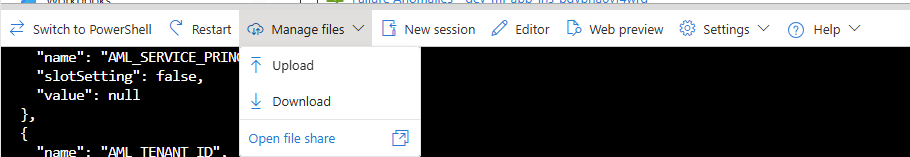

# 1-click deployment

The new way to deploy this solutions is using the 1-click deployment. This is the recommended way to deploy this solution.

## Known limitations

Due to an [upstream Bicep limitations with Service Principals](https://learn.microsoft.com/en-us/graph/templates/known-issues-graph-bicep?view=graph-bicep-1.0#application-passwords-are-not-supported-for-applications-and-service-principals), the 1-click deployment will NOT be able to create a secret. You will need to run a post-deployment script to create the secret and assign it to the API WebApp in order to complete the deployment.

## Pre-requisites

- You will need to have an Azure subscription and be able to create resources in it. At least a resource group is required, and the user must have `Owner` permissions.
- Addiitonally, you will need to have privileges to create an app registration/service principal.
- Using Cloud Shell is also recommend to finalize the deployment.

## Deployment steps (Azure Portal)

1. Click the "Deploy to Azure" button

    [](https://portal.azure.com/?feature.customportal=false#create/Microsoft.Template/uri/https%3A%2F%2Fraw.githubusercontent.com%2FAzure-Samples%2Fmultimodal-rag-code-execution%2Fmain%2Fdeployment%2Finfra-as-code-public%2Fbicep%2Fmain-1click.json)

1. Fill in parameters

    There no special parameters for this deployment. Optional parameters are available to customize the deployment (see below). Typically, only `openAIName` and `openAIRGName` are used to reuse an existing Azure OpenAI resource.

    Average deployment time is 10 minutes when no existing container registry is set.

1. Finalize deployment

    After the deployment is complete, you will need to run a post-deployment script to create the secret and assign it to the API WebApp.

    1. Open the **Azure Cloud Shell (Bash)**
    1. Upload the [`set-sp-secret.sh`](deployment/infra-as-code-public/bicep/set-sp-secret.sh) script to the Cloud Shell
    1. Run `chmod +x ./set-sp-secret.sh`
    1. Run `dos2unix ./set-sp-secret.sh`
    1. Run `./set-sp-secret.sh <app-name> <api-webapp-name> <ml-workspace-name> <resource-group-name>`.

    Values can be found in the deployment outputs: go to the resource group, select the deployment `main-1click`, and click on the `Outputs` tab.


<br />

**Note**: Upload script to cloud shell.
<br />
<p align="center">

</p>
<br/>


**Note**: Copy and paste the script call with the correct values.
<br />
<p align="center">

</p>
<br/>


## Customization

The following parameters are available for customization:

- `openAIName` and `openAIRGName`: Name and resource group for the Azure OpenAI resource to reuse, instead of creating a new one.
registry will be created and images will be built pushed to it via cloning the GitHub repository.
- `namePrefix`: Prefix for all resources created by the deployment. Default is `dev`.
- `newOpenAILocation`: Location for the new Azure OpenAI resource. Default is empty and will be ignored unless `openAIName` is blank.

## Deployment steps (local)

1. Clone the GitHub repository

    ```bash
    git clone https://github.com/Azure-Samples/multimodal-rag-code-execution

    cd multimodal-rag-code-execution
    ```

1. Run the deployment script

    You could run the below commands in either a Powershell or a Git Bash.

    ```bash
    az login
    
    az upgrade

    az bicep upgrade

    az group create --name multimodal-rag-code-execution --location <location>
    
    ## [OPTION 1] USE AN EXISTING OPENAI RESOURCE
    ## Existing OpenAI Resource must have one model name 'gpt-4o' and another named 'text-embedding-3-large'. Please provide the name of the OAI resource and the RG name where that resource is
    az deployment group create --resource-group multimodal-rag-code-execution --template-file deployment/infra-as-code-public/bicep/main-1click.bicep --parameters aiSearchRegion=eastus openAIName=<OAI_NAME> openAIRGName=<OAI_RG_NAME>

    ## [OPTION 2] CREATE A NEW OPENAI RESOURCE
    az deployment group create --resource-group multimodal-rag-code-execution --template-file deployment/infra-as-code-public/bicep/main-1click.bicep --parameters aiSearchRegion=eastus

    ```

1. Finalize deployment

    After the deployment is complete, you will need to run a post-deployment script to create the secret and assign it to the API WebApp.
    The `<appId>`, `<api-webapp-name>` and `<resource-group-name>` values are found int the deployment output of the previous steps, either when the script is ran locally, or in the Cloud shell, or in the Azure Portal.

    Make **sure** to run the below in a Git Bash shell, or Cloud shell. This will not work locally in a Powershell.

    1. Run `chmod +x ./set-sp-secret.sh`
    1. Run `./set-sp-secret.sh <app-name> <api-webapp-name> <ml-workspace-name> <resource-group-name>`.

        Values can be found in the deployment outputs: go to the resource group, select the deployment `main-1click`, and click on the `Outputs` tab.

<br/>
<br/>

### Screenshots of the Deployment

<br/>

In the Azure portal, go to Deployments:

<br />
<p align="center">

</p>
<br/>

Check all resources being deployed:

<br />
<p align="center">

</p>
<br/>

Once succeeded, click on the "main-1click":

<br />
<p align="center">

</p>
<br/>

Go to Outputs, and copy the PostDeployScript (this key has been recycled):

<br />
<p align="center">

</p>
<br/>

### Troubleshooting

If you see the below screenshot, please check your API web app, check its Environment Variables, and try to restart it.

Variables to check are:

- DOCKER_REGISTRY_SERVER_URL
- DOCKER_REGISTRY_SERVER_USERNAME
- DOCKER_REGISTRY_SERVER_PASSWORD

If problem persists, go to WebApp Deployment Center, and make sure:

- The container registry is connected via Admin credentials
- The "Continuous Deployment" option is enabled

<br />
<p align="center">

</p>
<br/>

## Updating web app images

There are two ways to update the web app images:

- **Option 1**: Rebuilding from remote git repository
- **Option 2**: Rebuilding from local

### Option 1: Rebuilding from remote git repository

This is the recommended approach if you simply need to get the latest features and bug fixes.

1. Go to the Azure Portal and open a Cloud Shell (Bash)
1. Copy the `update_webapps_from_github.sh` script to the Cloud Shell
1. Run `chmod +x update_webapps_from_github.sh`
1. Run `./update_webapps_from_github.sh <resource-group-name>`

Please note images will be built and pushed to the container registry sequentially. This process will take about 10 minutes. Additionally, the script will restart the API WebApp to use the new images.

### Option 2: Rebuilding from local

This is the recommended way to update the images if you have made changes to the code.

1. Clone the GitHub repository

    ```bash
    git clone https://github.com/Azure-Samples/multimodal-rag-code-execution

    cd multimodal-rag-code-execution
    ```

1. Make all required changes to the code
1. Run the `push.ps1` script using PowerShell

    ```powershell
    # Make sure to run from root of the repository
    .\deployment\push.ps1 -RG <resource-group-name>
    ```

    **NOTES**
    - script assumes you have the Azure CLI installed and logged in to the correct subscription
    - target resorce group must have been created by the deployment script
    - images will be built and pushed to the container registry sequentially. This process will take about 10 minutes.
    - All WebApps will restart to use the new images
