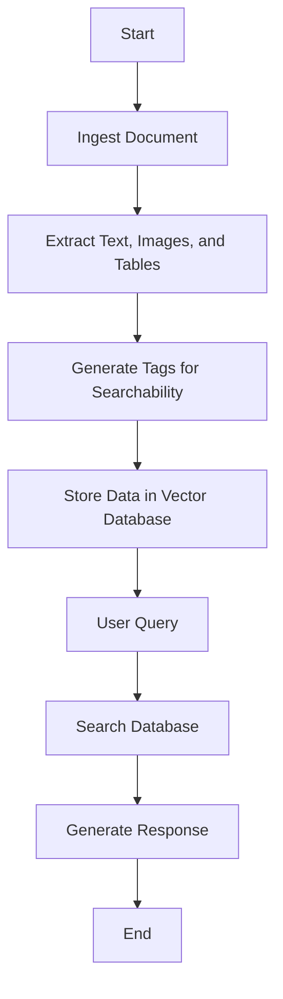

This application processes documents in a series of stages to provide the user with a response. Here's a simplified flow:

1. **Ingest Document**: The application begins by ingesting the document. This could be a local file or a URL, as determined by the [`is_file_or_url`](command:_github.copilot.openSymbolFromReferences?%5B%7B%22%24mid%22%3A1%2C%22path%22%3A%22%2Fc%3A%2FUsers%2Fricchi%2FOneDrive%20-%20Microsoft%2FDesktop%2Fmultimodal-rag-code-execution%2Fcode%2Fdoc_utils.py%22%2C%22scheme%22%3A%22file%22%7D%2C%7B%22line%22%3A755%2C%22character%22%3A4%7D%5D "code/doc_utils.py") function in [`code/doc_utils.py`](code/doc_utils.py).

2. **Extract Text, Images, and Tables**: The application then extracts text, images, and tables from the document. This is done using a variety of methods depending on the document type, as described in the [`README.md`](command:_github.copilot.openRelativePath?%5B%7B%22scheme%22%3A%22file%22%2C%22authority%22%3A%22%22%2C%22path%22%3A%22%2Fc%3A%2FUsers%2Fricchi%2FOneDrive%20-%20Microsoft%2FDesktop%2Fmultimodal-rag-code-execution%2FREADME.md%22%2C%22query%22%3A%22%22%2C%22fragment%22%3A%22%22%7D%5D "c:\Users\ricchi\OneDrive - Microsoft\Desktop\multimodal-rag-code-execution\README.md") file.

3. **Generate Tags for Searchability**: The application generates tags for all chunks of the document to improve searchability. This is done using the `generate_tags_for_all_chunks` function.

4. **Store Data in Vector Database**: The extracted data is then stored in a vector database. This allows for efficient searching later on.

5. **User Query**: The user submits a query to the application.

6. **Search Database**: The application searches the vector database for relevant information based on the user's query.

7. **Generate Response**: The application generates a response based on the search results. This could involve calculations, forecasts, or applying machine learning models using Code Interpreter capabilities.

8. **End**: The response is returned to the user.