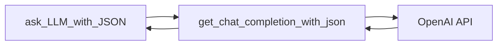

Sure, based on the code snippets you've provided, here's a high-level overview of the main functionality of the application:

## Main File: doc_utils.py

This file appears to be the main module of the application. It contains the following key functions:

### Function: [`ask_LLM_with_JSON(prompt, temperature = 0.2, model_info = None)`](command:_github.copilot.openSymbolFromReferences?%5B%7B%22%24mid%22%3A1%2C%22path%22%3A%22%2Fc%3A%2FUsers%2Fricchi%2FOneDrive%20-%20Microsoft%2FDesktop%2Fmultimodal-rag-code-execution%2Fcode%2Fdoc_utils.py%22%2C%22scheme%22%3A%22file%22%7D%2C%7B%22line%22%3A277%2C%22character%22%3A4%7D%5D "code/doc_utils.py")

This function is responsible for creating a chat with the OpenAI API. It takes a prompt, a temperature parameter for the OpenAI model, and an optional model_info dictionary. If model_info is provided, it creates a new AzureOpenAI client with the provided details; otherwise, it uses a global [`oai_client`](command:_github.copilot.openSymbolFromReferences?%5B%7B%22%24mid%22%3A1%2C%22external%22%3A%22file%3A%2F%2F%2Fc%253A%2FUsers%2Fricchi%2FOneDrive%2520-%2520Microsoft%2FDesktop%2Fmultimodal-rag-code-execution%2Fcode%2Fdoc_utils.py%22%2C%22path%22%3A%22%2Fc%3A%2FUsers%2Fricchi%2FOneDrive%20-%20Microsoft%2FDesktop%2Fmultimodal-rag-code-execution%2Fcode%2Fdoc_utils.py%22%2C%22scheme%22%3A%22file%22%7D%2C%7B%22line%22%3A160%2C%22character%22%3A0%7D%5D "code/doc_utils.py").

It then constructs a list of messages to send to the OpenAI API, including a system message describing the assistant's role and the user's prompt. It calls [`get_chat_completion_with_json`](command:_github.copilot.openSymbolFromReferences?%5B%7B%22%24mid%22%3A1%2C%22path%22%3A%22%2Fc%3A%2FUsers%2Fricchi%2FOneDrive%20-%20Microsoft%2FDesktop%2Fmultimodal-rag-code-execution%2Fcode%2Fdoc_utils.py%22%2C%22scheme%22%3A%22file%22%7D%2C%7B%22line%22%3A247%2C%22character%22%3A4%7D%5D "code/doc_utils.py") to get a response from the OpenAI API and returns the content of the first choice from the response.

### Function: [`get_chat_completion_with_json(messages: List[dict], model = AZURE_OPENAI_MODEL, client = oai_client, temperature = 0.2)`](command:_github.copilot.openSymbolFromReferences?%5B%7B%22%24mid%22%3A1%2C%22path%22%3A%22%2Fc%3A%2FUsers%2Fricchi%2FOneDrive%20-%20Microsoft%2FDesktop%2Fmultimodal-rag-code-execution%2Fcode%2Fdoc_utils.py%22%2C%22scheme%22%3A%22file%22%7D%2C%7B%22line%22%3A247%2C%22character%22%3A4%7D%5D "code/doc_utils.py")

This function is a helper function that sends a chat completion request to the OpenAI API. It takes a list of messages, a model name, an OpenAI client, and a temperature parameter. It prints some information about the request, sends the request, and returns the response.

## Logical Diagram

Here's a logical diagram of the application using Mermaid:

In this diagram, `ask_LLM_with_JSON` calls `get_chat_completion_with_json`, which sends a request to the OpenAI API. The API returns a response to `get_chat_completion_with_json`, which then returns the response to `ask_LLM_with_JSON`.

Please note that this is a high-level overview and the actual application may have more complexity.